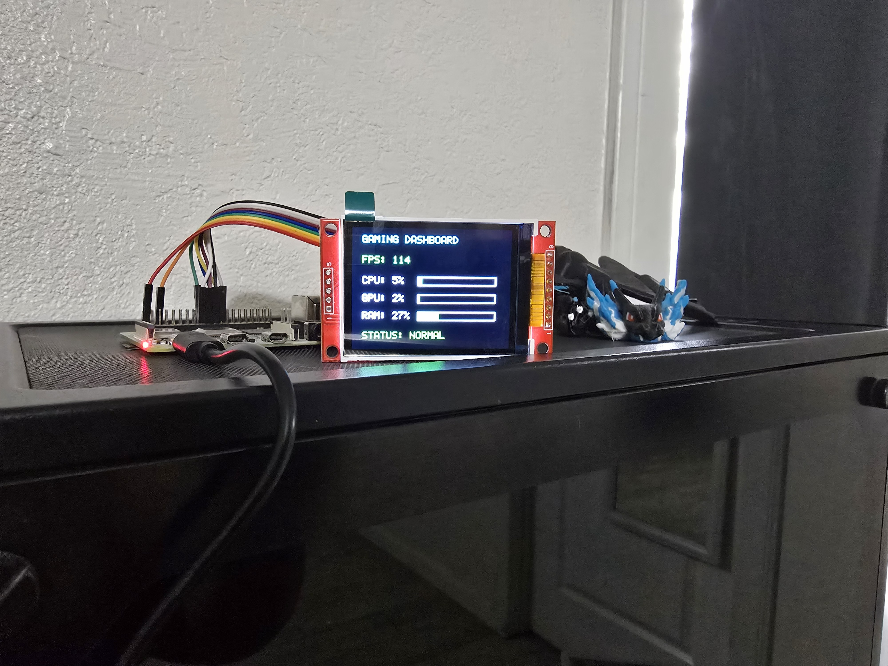

# EE5103 FinalProject

This project is a C++ hardware dashboard that monitors PC performance data and displays it on a Raspberry Pi-connected TFT screen. The system sends telemetry from a Windows PC to a Raspberry Pi over UDP, where the Raspberry Pi receives, processes, and displays the data in real time.

## Project Overview

The goal of this project is to demonstrate C++ programming fundamentals through a hardware-based performance monitoring system. The project focuses on object-oriented design, dynamic memory management, resource ownership, and hardware communication.

The dashboard currently displays:

- FPS
- CPU usage
- GPU usage
- RAM usage
- System warning status

## Hardware Used

- Raspberry Pi 4
- 2.2" SPI TFT LCD Display
- PC with NVIDIA GPU
- SPI communication between Raspberry Pi and TFT display
- UDP communication between PC and Raspberry Pi

## Software Features

- Windows C++ telemetry sender
- Raspberry Pi C++ UDP receiver
- Real-time telemetry transfer over local network
- ILI9341 display control in C++
- Object-oriented class design
- Resource ownership using constructors and destructors

## How to Run
On the Raspberry Pi in Bash Terminal:

```Bash
$ g++ main.cpp ILI9341Display.cpp -o dashboard -std=c++17 -lgpiod
$ sudo ./dashboard
```
Expected Output:
```
Listening for telemetry on UDP port 5000...
```

On Windows, compile the telemetry sender and run:
```Terminal
g++ send_data.cpp -o send_data.exe -std=c++17 -lws2_32
./send_data.exe
```
The Windows PC sends telemetry data in this format:
```
FPS,CPU,GPU,RAM
```
After running on Windows PC, the data received on the Raspberry Pi should output as such:
```
Gaming Dashboard
----------------
FPS: xx
CPU Usage: xx%
GPU Usage: xx%
RAM Usage: xx%
```

This is how it looks on the Raspberry Pi:



## Project Purpose
This project was created as a final C++ hardware project to connect software design concepts with a practical embedded-style system. It demonstrates how C++ can be used to manage hardware resources, communicate over a network, and display real-time performance information on an external device.